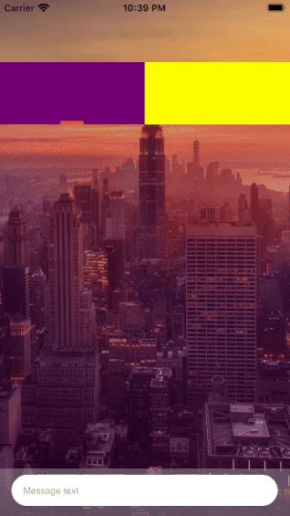

# GLTabBar

A container view controller that manages a tab bar selection interface, where the selection determines which content view to display.

### Architecture

##### Core
* `Protocols` - contains a delegate and data source protocols
* `ViewControllers` - contains tab bar controller specializes in managing a tab bar view 
* `Views` - tab bar view itself
* `Model` - few entities to handle tab bar operations

## Authors
* **Alexey Gross** - *Initial work* - [alexey.gross][AG]
* **Mikhail Li** - [mikhail.li][ML]

[AG]: https://github.com/grosshub
[ML]: https://github.com/l1nkey
